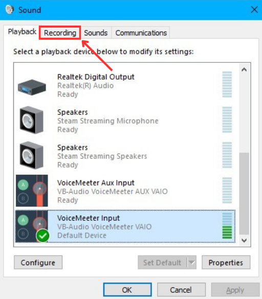
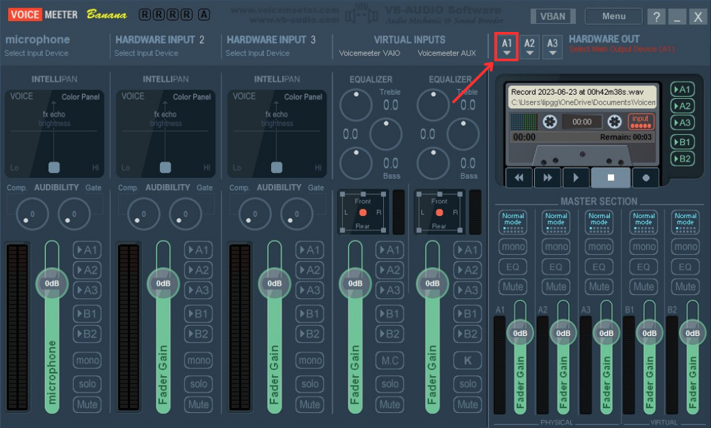

## How to use with Discord and Games

You can use this code with Discord and your favorite Games by following this guide.

1. Download [EarTrumpet](https://eartrumpet.app/), [VoiceMeeter banana](https://vb-audio.com/Voicemeeter/banana.htm)(after you install VoiceMeeter banana you'll also need to restart your PC) and open VoiceVox.
2. For VoiceMeeter banana, we need to change voice output and voice input first.
   1. Open the Control Panel by pressing the `Windows key` and typing `Control Panel`. In the upper right corner, click on `View by` and select `Large icon`.
      
      
      
      
   2. Click on `Sound`, scroll down until you see `VoiceMeeter Input`, and then click on it. Finally, click `Set Default`.
      
      
      
      
   3. Click on `Recording` at the top, scroll down until you see `VoiceMeeter Aux Output`, click on it, and then click `Set Default`. After this step, we'll continue to the VoiceMeeter program.
      
      
      
      
   4. The first time the program is opened, it would look like this.
      
      
      
   5. Click on each `A1` to deselect them on all five panels. Similarly, do the same with `B1`. It should now look like this.

      
      
      
   6. On the upper right corner, click on `A1` and select your speaker output (WDM is recommended).
  
      
      

   7. Now, click on `A1` for all VIRTUAL INPUTS. However, for VOICEMEETER AUX, you'll also need to click on `B1`.
       
      

3. Running the code, open EarTrumpet and scroll down to the bottom you'll see `VoiceMeeter Input (VB-Audio VoiceMeeter VAIO)`, right click on `Python 3.11.xx` and click on `change` icon, select `VoiceMeeter Aux Input (VB-Audio VoiceMeeter AUX VAIO)`.
   
   
   
   
   
4. Change your `playback/output device` by clicking on the speaker icon on the taskbar (or go to `window setting` -> `System` -> `Sound` -> `Choose your output device`). Select `VoiceMeeter Aux Input (VB-Audio VoiceMeeter AUX VAIO)` first and then selcet `VoiceMeeter Input (VB-Audio VoiceMeeter VAIO)` (we need to do this process to let Python recognize these playback devices).
   
   
   
   
5. To use with Discord, open Discord go to setting and navigate to `Voice & Video`, on the `INPUT DEVICE` choose `VoiceMeeter Output (VB-Audio VoiceMeeter VAIO)`.

   
   
6. Example for how to use in game, open your favorite Games go to setting and navigate to audio setting, on the input device choose `VoiceMeeter Output (VB-Audio VoiceMeeter VAIO)`.
  
   
